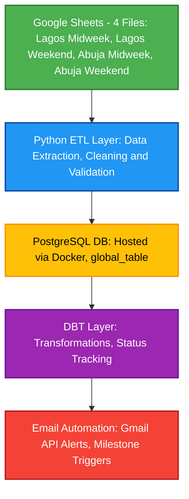

# Datapluga Analytics Pipeline
> An end-to-end automated data engineering pipeline for real-time student subscription analytics and personalized notifications.


## Project Overview
### The Problem

At Datapluga, student enrollment and subscription data were manually tracked across multiple Google Sheets for different locations (Lagos and Abuja).
Each location managed its own sheet, making it difficult to:

- Maintain data consistency across branches
- Track subscription lifecycles or milestone renewals
- Send timely notifications to students nearing subscription expiration

This manual process was error-prone and time-consuming — an ideal candidate for data engineering automation.

### The Solution

I designed and implemented a fully automated analytics pipeline that connects Google Sheets, PostgreSQL, DBT, and Gmail APIs into one cohesive system.

The pipeline:

- Extracts data from multiple Google Sheets in real-time
- Cleans and validates it automatically
- Loads it into a PostgreSQL database running in Docker
- Runs DBT models to track student subscription milestones
- Sends personalized milestone emails to students via Gmail API

This transformed a manual weekly reporting process into a hands-free, analytics-ready pipeline that runs automatically every day.


## Architecture Overview


## Tech Stack
| Layer                          | Tools & Technologies                         |
| ------------------------------ | -------------------------------------------- |
| **Data Ingestion**             | Google Sheets API, Python (Requests, Pandas) |
| **Data Storage**               | PostgreSQL (Dockerized)                      |
| **Transformation**             | DBT (Data Build Tool)                        |
| **Automation & Orchestration** | Python scripting, cron jobs                  |
| **Email Notifications**        | Gmail API (OAuth2)                           |
| **Containerization**           | Docker, Docker Compose                       |
| **Monitoring & Logging**       | Custom Python logging module                 |


## How It Works

1. Data Extraction:
- The Python ETL script connects to 4+ Google Sheets using the Sheets API.
- Each sheet (for different campuses) is published as a CSV endpoint for real-time pulls.

2. Data Cleaning & Validation:
- Pandas ensures column names are standardized across sheets.
- Missing values, incorrect date formats, and duplicates are automatically handled.

3. Database Loading:
- Cleaned data is written into global_table within a PostgreSQL container.
- Each pipeline run truncates old data and refreshes the database.

4. Transformation (DBT):
- DBT models transform raw data into analytical models for tracking:
- Days Remaining until subscription ends
- Adjusted End Dates
- Active vs Expired Subscriptions

5. Email Notifications:
- Using the Gmail API, milestone-based emails (e.g., Day 0, 30, 60, 90) are sent to students.
- OAuth2 authentication ensures secure access and automatic token refresh.

6. Automation & Scheduling:
- The pipeline can be scheduled to run daily via cron (Linux/macOS) or Task Scheduler (Windows).
- Logs are generated in real-time to pipeline.log for easy monitoring.

## Key Features
🔹 Data Pipeline
- Real-time extraction from multiple Google Sheets
- Automated data cleaning and validation
- Dynamic handling of missing or inconsistent data

🔹 Database Management
- PostgreSQL containerized with Docker
- PgAdmin for visual DB management
- Automated refresh of tables

🔹 Transformation Layer
- Modular DBT models for subscription analysis
- Historical data preservation and incremental updates

🔹 Notification System
- Gmail API integration with milestone-based automation
- Personalized and templated messages
- Secure OAuth2 authentication

## Infrastructure & Deployment
To ensure portability, stability, and ease of management, the core infrastructure components—the PostgreSQL database and its administration interface—were containerized using Docker.

### containerized Environment (Docker)
The project leverages docker-compose to define and run the multi-container application, demonstrating proficiency in setting up reproducible local environments.
- Goal: Quickly stand up the database and administration tools with minimal host configuration.
- Containers Deployed:
   - postgres_db: The relational database for persistent storage.
   - pgadmin: The web-based UI for database management.
   - pythonscripts: (Implied) The container where the ETL and DBT logic is executed.

The successful creation and running status of the postgres_db, pgadmin, and pythonscripts containers.


### Database Setup (PostgreSQL & pgAdmin)
PostgreSQL was chosen for its reliability, transactional integrity, and strong support for analytical queries.

- Database Management: The pgadmin container provides a professional interface for monitoring and managing the database.
- Environment Segregation: The setup includes two distinct databases:
    - pgp_db: Production or development database where the transformation models live.
    - prod_db: (Likely) A separate environment for final production data or schema organization.

The pgAdmin dashboard shows the two distinct databases, pgp_db and prod_db, allowing for clear separation of development/staging and final production data.


## ETL Logic & Orchestration (Python)
The core pipeline logic is managed by a single Python script (pipeline.py), which orchestrates the entire workflow from source extraction to final notification.

### The Python Engine
The script demonstrates several key data engineering concepts:

1. Extraction (refresh_data):
- Iterates through multiple Google Sheet URLs (Lagos and Abuja, Midweek/Weekend), consolidating disparate data sources into a single, unified Pandas DataFrame.
- Leverages the requests and pandas libraries for robust HTTP data retrieval and parsing.

2. Transformation/Cleaning:
- Data Standardization: Includes utility functions (clean_column_names, clean_dates, better_clean_numerics) to standardize column names, enforce correct data types (especially for dates and numeric values), and handle missing values (pd.to_numeric(errors='coerce')).
- Metadata Injection: Adds valuable context (e.g., source, location, course) to each row during extraction to enable downstream analysis.

3. Loading (load_to_postgres):
- Uses SQLAlchemy to connect to the containerized PostgreSQL database.
- Implements a full refresh strategy (TRUNCATE TABLE global_table;) followed by bulk insertion (df.to_sql) to ensure the raw data is always current.
- Raw data is ingested into the global_table after initial cleaning, serving as the staging layer for DBT transformations.

#### Automated Action Layer
The final stage uses a microservice approach to trigger immediate business value:

- DBT Integration (run_dbt): Executes the DBT transformation step as a subprocess, ensuring the analytical tables are up-to-date before notifications are checked.
- Gmail API: Uses Google's official API for secure, personalized email delivery, demonstrating proficiency with external cloud services.
- Milestone Logic: The send_email_gmail function maps the calculated days_left (e.g., 90, 60, 30, 10, 0) to specific, relevant email templates, creating a personalized customer retention touchpoint.

```
import requests
import pandas as pd
from io import StringIO
from sqlalchemy import create_engine, text
from urllib.parse import quote_plus
import subprocess
from datetime import datetime
import psycopg2
import os
import pickle
import base64
import re
from google.auth.transport.requests import Request
from google_auth_oauthlib.flow import InstalledAppFlow
from googleapiclient.discovery import build
from email.mime.text import MIMEText
from dotenv import load_dotenv
import logging

# Load environment variables
load_dotenv()

# Configure logging
logging.basicConfig(
    level=logging.INFO,
    format='%(asctime)s - %(levelname)s - %(message)s',
    handlers=[
        logging.FileHandler('pipeline.log'),
        logging.StreamHandler()
    ]
)
logger = logging.getLogger(__name__)

# ---------------------
# CONFIG FROM ENVIRONMENT
# ---------------------

sheet_sources = {
    "Lagos Midweek": os.getenv("SHEET_LAGOS_MIDWEEK"),
    "Lagos Weekend": os.getenv("SHEET_LAGOS_WEEKEND"),
    "Abuja Midweek": os.getenv("SHEET_ABUJA_MIDWEEK"),
    "Abuja Weekend": os.getenv("SHEET_ABUJA_WEEKEND")
}

sheet_metadata = {
    "Lagos Midweek": {"location": "Lagos", "course": "Data Analytics"},
    "Lagos Weekend": {"location": "Lagos", "course": "Data Analytics"},
    "Abuja Midweek": {"location": "Abuja", "course": "Data Analytics"},
    "Abuja Weekend": {"location": "Abuja", "course": "Data Analytics"}
}

# PostgreSQL DB connection from environment
db_user = os.getenv('DB_USER')
db_password = quote_plus(os.getenv('DB_PASSWORD'))
db_host = os.getenv('DB_HOST', 'localhost')
db_port = os.getenv('DB_PORT', '5432')
db_name = os.getenv('DB_NAME')
connection_str = f'postgresql+psycopg2://{db_user}:{db_password}@{db_host}:{db_port}/{db_name}'
engine = create_engine(connection_str)

# Gmail API config
SCOPES = ['https://www.googleapis.com/auth/gmail.send']
CLIENT_SECRET_FILE = os.getenv('CLIENT_SECRET_FILE')
TOKEN_FILE = 'token.pickle'

# DBT project path
DBT_PROJECT_PATH = os.getenv('DBT_PROJECT_PATH')

# ---------------------
# DATA CLEANING FUNCTIONS
# ---------------------

def clean_column_names(df):
    df.columns = (
        df.columns
        .str.strip()
        .str.replace(r'[^\w\s]', '', regex=True)
        .str.replace(r'\s+', '_', regex=True)
        .str.replace(r'__+', '_', regex=True)
        .str.lower()
    )
    return df

def clean_dates(df, date_cols):
    for col in date_cols:
        if col in df.columns:
            df[col] = pd.to_datetime(df[col], errors='coerce').dt.date
    return df

def better_clean_numerics(df, num_cols):
    for col in num_cols:
        if col in df.columns:
            df[col] = df[col].astype(str).str.replace(r"[^\d\.\-]", "", regex=True)
            df[col] = df[col].replace('', None)
            df[col] = pd.to_numeric(df[col], errors='coerce')
    return df

# ---------------------
# FULL DATA PIPELINE
# ---------------------

def refresh_data():
    logger.info("Starting data refresh...")
    dfs = []
    for source, url in sheet_sources.items():
        try:
            response = requests.get(url, timeout=30)
            if response.status_code == 200:
                df = pd.read_csv(StringIO(response.text), dtype=str)
                df = clean_column_names(df)
                df["source"] = source
                df["location"] = sheet_metadata[source]["location"]
                df["course"] = sheet_metadata[source]["course"]
                dfs.append(df)
                logger.info(f"✅ Successfully loaded: {source}")
            else:
                logger.error(f"❌ Failed to load: {source} (Status: {response.status_code})")
        except Exception as e:
            logger.error(f"❌ Error loading {source}: {e}")
    
    if not dfs:
        logger.error("No data loaded from any source!")
        return None
    
    full_df = pd.concat(dfs, ignore_index=True)

    date_columns = ['timestamp', 'payment_date', 'payment_date_2nd', 'payment_date_3rd', 'start_date', 'ssdate', 'sub_end']
    numeric_columns = ['amount', '1st_installment', '2nd', '3rd', 'sub_days', 'sub_left', 'on_a_scale_of_1_10_what_is_your_skill_level_in_data_analytics']

    full_df = clean_dates(full_df, date_columns)
    full_df = better_clean_numerics(full_df, numeric_columns)
    full_df = full_df.where(pd.notnull(full_df), None)

    logger.info(f"Data refresh complete. Total rows: {len(full_df)}")
    return full_df

def load_to_postgres(df):
    if df is None or df.empty:
        logger.error("Cannot load empty dataframe to PostgreSQL")
        return False
    
    try:
        with engine.begin() as conn:
            conn.execute(text("TRUNCATE TABLE global_table;"))
        df.to_sql('global_table', engine, if_exists='append', index=False, method='multi')
        logger.info("✅ Table truncated and refreshed.")
        return True
    except Exception as e:
        logger.error(f"❌ Failed to load to PostgreSQL: {e}")
        return False

def run_dbt():
    try:
        subprocess.run(
            ["dbt", "run", "--full-refresh"], 
            cwd=DBT_PROJECT_PATH,
            check=True,
            capture_output=True,
            text=True
        )
        logger.info("✅ DBT models refreshed.")
        return True
    except subprocess.CalledProcessError as e:
        logger.error(f"❌ DBT run failed: {e.stderr}")
        return False
    except Exception as e:
        logger.error(f"❌ Error running DBT: {e}")
        return False

def get_milestone_candidates():
    try:
        conn = psycopg2.connect(
            dbname=db_name, 
            user=db_user, 
            password=os.getenv('DB_PASSWORD'), 
            host=db_host, 
            port=db_port
        )
        cur = conn.cursor()
        query = """
        SELECT 
            candid, 
            start_date, 
            adjusted_end_date, 
            (
                (sub_days + COALESCE(paused_days, 0) + COALESCE(extra_days, 0)) 
                - (CURRENT_DATE - start_date)
            ) AS days_left, 
            email
        FROM subscription_status
        WHERE (
                (sub_days + COALESCE(paused_days, 0) + COALESCE(extra_days, 0)) 
                - (CURRENT_DATE - start_date)
              ) IN (90, 60, 30, 10, 0)
           OR start_date = CURRENT_DATE
        """
        cur.execute(query)
        data = cur.fetchall()
        cur.close()
        conn.close()
        logger.info(f"Found {len(data)} milestone candidates")
        return data
    except Exception as e:
        logger.error(f"❌ Error fetching milestone candidates: {e}")
        return []

# ---------------------
# GMAIL API AUTH
# ---------------------

def gmail_auth():
    try:
        creds = None
        if os.path.exists(TOKEN_FILE):
            with open(TOKEN_FILE, 'rb') as token:
                creds = pickle.load(token)
        if not creds or not creds.valid:
            if creds and creds.expired and creds.refresh_token:
                creds.refresh(Request())
            else:
                flow = InstalledAppFlow.from_client_secrets_file(CLIENT_SECRET_FILE, SCOPES)
                creds = flow.run_local_server(port=0)
            with open(TOKEN_FILE, 'wb') as token:
                pickle.dump(creds, token)
        logger.info("✅ Gmail authentication successful")
        return build('gmail', 'v1', credentials=creds)
    except Exception as e:
        logger.error(f"❌ Gmail authentication failed: {e}")
        return None

# ---------------------
# SEND EMAIL
# ---------------------

def send_email_gmail(name, days_left, email, service):
    if service is None:
        logger.error("Gmail service not initialized")
        return False
    
    if days_left == 90:
        body = f"""Hi {name},\n\nWelcome to Datapluga! Your 90-day subscription begins today!\n"""
    elif days_left == 60:
        body = f"Hi {name}, 30 days in! Keep pushing 💪."
    elif days_left == 30:
        body = f"Hi {name}, 60 days down, just 30 more to go."
    elif days_left == 10:
        body = f"Hi {name}, only 10 days left. Wrap up strong!"
    elif days_left == 0:
        body = f"Hi {name}, your subscription has expired. Please consider renewing."
    else:
        return False

    message = MIMEText(body)
    message['to'] = email
    message['from'] = 'me'
    message['subject'] = '📬 Datapluga Subscription Update'

    raw_message = {'raw': base64.urlsafe_b64encode(message.as_bytes()).decode()}

    try:
        service.users().messages().send(userId='me', body=raw_message).execute()
        logger.info(f"📩 Email sent to {name} ({email})")
        return True
    except Exception as e:
        logger.error(f"❌ Failed to send email to {name}: {e}")
        return False

# ---------------------
# MAIN WORKFLOW
# ---------------------

def main():
    logger.info(f"\n⏰ Pipeline started at {datetime.now().strftime('%Y-%m-%d %H:%M:%S')}")
    
    try:
        # Step 1: Refresh data
        df = refresh_data()
        if df is None:
            logger.error("Data refresh failed. Aborting pipeline.")
            return False
        
        # Step 2: Load to PostgreSQL
        if not load_to_postgres(df):
            logger.error("PostgreSQL load failed. Aborting pipeline.")
            return False
        
        # Step 3: Run DBT
        if not run_dbt():
            logger.error("DBT run failed. Aborting pipeline.")
            return False
        
        # Step 4: Send emails
        service = gmail_auth()
        if service:
            milestones = get_milestone_candidates()
            for row in milestones:
                candid, start_date, end_date, days_left, email = row
                send_email_gmail(candid, days_left, email, service)
        
        logger.info(f"✅ Pipeline completed successfully at {datetime.now().strftime('%Y-%m-%d %H:%M:%S')}")
        return True
        
    except Exception as e:
        logger.error(f"❌ Pipeline failed with error: {e}")
        return False

if __name__ == "__main__":
    main()
```


The raw table is loaded to Postgres as global_table which is an append of the 4 tables. After the raw data is loaded, DBT (Data Build Tool) is utilized to transform and model the data into easily consumable tables for analytics and action.


## Data Modeling & Analytics (DBT)
DBT (Data Build Tool) is the core transformation layer, ensuring the raw and inconsistent data from Google Sheets is modeled into reliable, analytically ready tables. This guarantees data quality and provides the single source of truth for the automated email trigger.

The subscription_status Model
This model is the most critical component of the pipeline, as it calculates the dynamic metrics used for automated communication.
- Technology: PostgreSQL SQL (within DBT).
- Materialization: The model uses materialized='incremental' with unique_key='candid'. This is a crucial optimization, ensuring only new or updated student records are processed each day, significantly reducing database load and pipeline run time.

### Key Business Logic & Metrics
The subscription_status model demonstrates the handling of complex business rules via SQL:
| **Metric** | **Calculation Logic** | **Purpose** |
|-------------|------------------------|--------------|
| `adjusted_end_date` | `start_date + (sub_days + paused_days + extra_days)` | Calculates the true expiration date, accounting for any pauses or extensions granted to the student. |
| `days_left` | `(Subscription Duration) - (Days Elapsed Since Start)` | The core metric used by the Python script to determine if a student has hit a 90, 60, 30, 10, or 0-day milestone. |
| `is_expired` | `CASE WHEN CURRENT_DATE > adjusted_end_date THEN TRUE` | A simple flag for operational reporting and identifying students due for renewal outreach. |

SQL Snippet (Milestone Logic)
```
-- models/subscriptions/subscription_status.sql

{{ config(materialized='incremental', unique_key='candid') }}

WITH base AS (
    SELECT 
        candid,
        start_date,
        sub_days,
        email
    FROM {{ ref('base_subscription') }}
),

pauses AS (
    SELECT 
        candid,
        total_paused_days
    FROM {{ ref('pause_data') }}
),

extension AS (
    SELECT 
        candid,
        total_extra_days
    FROM {{ ref('extension_data') }}
),

final AS (
    SELECT
        base.candid,
        base.start_date,
        base.sub_days,
        COALESCE(pauses.total_paused_days, 0) AS paused_days,
        COALESCE(extension.total_extra_days, 0) AS extra_days,
        base.email,

        -- adjusted end date calculation
        base.start_date 
        + ((base.sub_days + COALESCE(pauses.total_paused_days, 0) + COALESCE(extension.total_extra_days, 0)) * INTERVAL '1 day')
        AS adjusted_end_date,

        CURRENT_DATE AS today,

        EXTRACT(DAY FROM (
    (
        base.sub_days
        + COALESCE(pauses.total_paused_days, 0)
        + COALESCE(extension.total_extra_days, 0)
    ) * INTERVAL '1 day'
    - (CURRENT_DATE - base.start_date)
)) AS days_left,


        -- expiration flag
        CASE 
            WHEN CURRENT_DATE > (
                base.start_date 
                + ((base.sub_days + COALESCE(pauses.total_paused_days, 0) + COALESCE(extension.total_extra_days, 0)) * INTERVAL '1 day')
            ) THEN TRUE 
            ELSE FALSE 
        END AS is_expired

    FROM base
    LEFT JOIN pauses USING (candid)
    LEFT JOIN extension USING (candid)
)

SELECT * 
FROM final


WHERE candid NOT IN (SELECT candid FROM {{ this }})

```

This table serves as the clean, daily-updated interface between the raw source data and the automated email actions.


## Automated Action & Impact
The entire pipeline's success is measured by its ability to take automated, timely action based on the transformed data. The final step is the personalized student notification system, powered by the Gmail API.

### Personalized Student Outreach
The Python script queries the subscription_status model for students hitting a milestone (days_left in 90, 60, 30, 10, or 0) and uses the Gmail API to send targeted communications.
- Custom Templates: The script dynamically selects the appropriate email body based on the calculated days_left (e.g., "Welcome" for Day 90, "Wrap up strong!" for Day 10).
- Proof of Concept: The screenshots below confirm the successful execution and delivery of these personalized updates.
   > Successful delivery of automated emails, confirming the end-to-end functionality of the pipeline from data extraction to customer communication.
   > Detail of a single welcome email, validating the personalized subject line and body text based on the student's subscription status.

Email notification


Email for the 90 days subscription start


Email automation for those with 30 days left


Lastly, email notification for those with 10 days left


## Impact & Results

- 100% Automation: Transformed a manual weekly process into a fully automated daily pipeline.
- Data Integrity: Centralized data in PostgreSQL, eliminating data inconsistency across campus sheets.
- Proactive Retention: Enabled timely student communication, improving the potential for subscription renewals.
- Time Savings: Reduced staff time spent on manual reporting and data aggregation by an estimated [e.g., 8 hours per week].


## Lessons Learned

- Handling API rate limits effectively when fetching from multiple Google Sheets
- Managing secrets securely using environment variables and .gitignore
- Using DBT for modular SQL transformations improved maintainability
- Building idempotent pipelines (safe to re-run without duplication)
- Incorporating email automation seamlessly into a data workflow

## Future Improvements

- Integrate with Airflow for advanced scheduling and dependency management
- Add a dashboard layer (e.g., Power BI or Metabase) for visualization
- Extend notifications to Slack or WhatsApp APIs for broader engagement


👤 Author

Emmanuel Justice
📧 emmanueljustice25@gmail.com

🔗 Linkedln: https://www.linkedin.com/in/emmanuel-justice \
GitHub: https://github.com/Emmaue

 ⭐ If you found this project insightful, please give it a star!
This project is part of my Data Engineering Portfolio, showcasing my experience in building automated data pipelines, modeling transformations, and integrating analytics with real-world automation.
